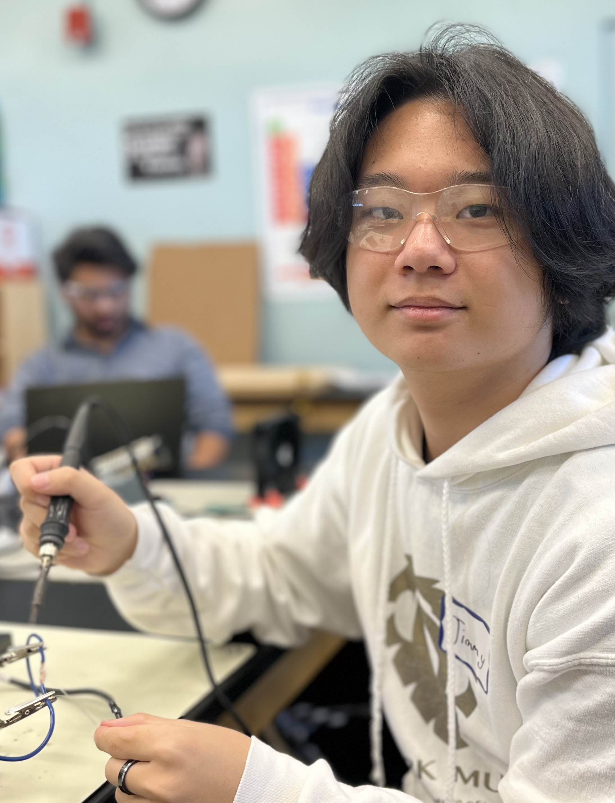

# IoT Air Pollution Monitor
My main project is the Air Pollution Monitor. This project provides accurate and real-time data on air quality using a sophisticated network of integrated sensors and complex softwares. It is an initiative that marks a significant step forward to fight against environmental pollution and promote a clearner and healhier Earth. I chose this project because it delves into the statstics of air pollution, this is vital to raising awareness of the polluted air that we breath in. This project also teached me the background of climate change and the effects caused by air polluton. For example, humid air traps pollutants close to the ground and prevents them from dispersing into the atmosphere, this increases the pollutants in the air that we breath and it is extremely harmful to our lungs, this effect is significantly increased in urban areas.

| **Engineer** | **School** | **Area of Interest** | **Grade** |
|:--:|:--:|:--:|:--:|
| Jimmy C | Aliso Niguel High School | Engineering | Incoming Senior

 

# Final Milestone

<iframe width="560" height="315" src="https://www.youtube.com/embed/dXnVTu0mpJo?si=jdoMR3lpmP9R4Jg6" title="YouTube video player" frameborder="0" allow="accelerometer; autoplay; clipboard-write; encrypted-media; gyroscope; picture-in-picture; web-share" referrerpolicy="strict-origin-when-cross-origin" allowfullscreen></iframe>

## Summary

For my final milestone, I planned to begin designing my enclosure and also collect data over several days to verify the functionality of my project. Since my last milestone, I've collected roughly 3 days worth of data and at different pleaces. For example, at BSE the AQI quality was good and at home it was moderate. This shows that my project works and also practical to test home air qualities. Secondly, while I waited for the data to collect and upload I began designing my enclosure and modifications. I've gone from a simple single box enclosure designs to a multiboxed and enviromental friendly enclosure that uses recyclable 3d printing material. I intinally planned on a single enclosure with a locking mechanism, however, due to complications with accessing the project and dampness issues that may occure on rainly days. I changed the idea from a single box enclosure to instead use two boxes that interlocks with one another and allows for wiring through the interlocking part. This design took me a long time to come up with but after careful and precise planning, I drew the skeleton of my final blueprint.

## Challenges

As for my challenges, I would like to talk about my challenges on both my start and main project on my final milestone and also the challenges I've faced at BSE. My start project was fairly simple and easy to understand, although most of the project involved soldering and not as much software, I still struggled as it was my first time soldering. The most difficult part of my start project was defitnetly the soldering, not because I wasn't profecient in it but rather becase the soldering iron I was given was defective and took a long time to heat and would not reach high enough temperature to melt the soldering iron. All in all, my starter project wasn't too challenging and intead I think it was a fun and enjoyable experience that helped me ease into my main project. During my main project was where I faced the most trouble and complications, the instructions I was given was unclear and incorrect. Multiple steps in the instructions led me further away from completing the project, I worked with an instructor to debug the software and through many hours of debugging, we found out that there were also hardware issues such as, wiring into incorrect slots and missing wires that the instructions caused. It took a lot of time to finish debugging my project and fixing the code, the hardware was fairly easy but still gave me plenty of trouble. All in all, at BSE I believe that through the help of instructos any challenges can be faced. Im glad that I was able to run into these errors as it gave me a learning opportunity and a better way to connect with other students and instructos at BSE.


## Blueprints


<!--
- What you've accomplished since your previous milestone
- What your biggest challenges and triumphs were at BSE
- A summary of key topics you learned about
- What you hope to learn in the future after everything you've learned at BSE
-->

# Second Milestone

<iframe width="560" height="315" src="https://www.youtube.com/embed/1OoLK4JQN5g?si=Lf8_twR83oalOYw7" title="YouTube video player" frameborder="0" allow="accelerometer; autoplay; clipboard-write; encrypted-media; gyroscope; picture-in-picture; web-share" referrerpolicy="strict-origin-when-cross-origin" allowfullscreen></iframe>

## Summary
For my second milestone, I planned to finish setting up the software for my project. It didn’t end up going as planned. I faced many obstacles and setbacks. For example,  the instructions I was given were unclear and incorrect and it led to problems with the wiring. I couldn’t connect my air particle sensor to the rest of the hardware due to this and this led me to learn more about each type of pin and I ended up resoldering multiple wires from the incorrect ports to the correct ones. Later I tested the code that was given to me for my project and unfortunately it also ended up being incorrect, the code was outdated and many files that were necessary for the project to function were not provided. To solve this problem, I had to write most of the new code. The original code had roughly 150 lines of code and after debugging and rewriting the code, it ended up at roughly 200 lines of code. With the help of other students that are doing the same project and through the guidance of our instructors we succeeded in debugging and reconstructing the project. In the end all the hardware and software were fixed and the project uploaded data to the website.

## Challenges

I faced many challenges thorughout my second milestone, the instructions I was given was mostly incorrect and difficult to follow. As a result, I had recoded most of the program and reassembled a lot of my wires in order to solve the problem. I learned more about what each pin did in my project and one thing that was important to my project that I learned was the importance of managing voltages and currents. After a deep dive into the projects previously given code, I found out that the given files were also incorrect. There were multiple missing files and some were designed for another project. To help other students with this project in the future, I also helped to rewrite a set of instructions for future indivisuals who may attempt this project.

## Code for Main Project
```ruby
import time
import board
import busio
from digitalio import DigitalInOut, Direction, Pull
from adafruit_esp32spi import adafruit_esp32spi, adafruit_esp32spi_wifimanager
from adafruit_io.adafruit_io import IO_HTTP
from simpleio import map_range
from adafruit_pm25.uart import PM25_UART
from adafruit_bme280 import basic as adafruit_bme280
import supervisor
import gc
import adafruit_pm25
import adafruit_bme280
from adafruit_bme280 import basic as adafruit_bme280
#from adafruit_bme280 import Adafruit_BME280_I2C

print("xasdasd")


# Sensor Functions
def calculate_aqi(pm_sensor_reading):
    """Returns a calculated air quality index (AQI)
    and category as a tuple.
    NOTE: The AQI returned by this function should ideally be measured
    using the 24-hour concentration average. Calculating a AQI without
    averaging will result in higher AQI values than expected.
    :param float pm_sensor_reading: Particulate matter sensor value.

    """
    # Check sensor reading using EPA breakpoint (Clow-Chigh)
    try:
        if 0.0 <= pm_sensor_reading <= 12.0:
            # AQI calculation using EPA breakpoints (Ilow-IHigh)
            aqi_val = map_range(int(pm_sensor_reading), 0, 12, 0, 50)
            aqi_cat = "Good"
        elif 12.1 <= pm_sensor_reading <= 35.4:
            aqi_val = map_range(int(pm_sensor_reading), 12, 35, 51, 100)
            aqi_cat = "Moderate"
        elif 35.5 <= pm_sensor_reading <= 55.4:
            aqi_val = map_range(int(pm_sensor_reading), 36, 55, 101, 150)
            aqi_cat = "Unhealthy for Sensitive Groups"
        elif 55.5 <= pm_sensor_reading <= 150.4:
            aqi_val = map_range(int(pm_sensor_reading), 56, 150, 151, 200)
            aqi_cat = "Unhealthy"
        elif 150.5 <= pm_sensor_reading <= 250.4:
            aqi_val = map_range(int(pm_sensor_reading), 151, 250, 201, 300)
            aqi_cat = "Very Unhealthy"
        elif 250.5 <= pm_sensor_reading <= 350.4:
            aqi_val = map_range(int(pm_sensor_reading), 251, 350, 301, 400)
            aqi_cat = "Hazardous"
        elif 350.5 <= pm_sensor_reading <= 500.4:
            aqi_val = map_range(int(pm_sensor_reading), 351, 500, 401, 500)
            aqi_cat = "Hazardous"
        else:
            print("Invalid PM2.5 concentration")
            aqi_val = -1
            aqi_cat = None
        return aqi_val, aqi_cat
    except (ValueError, RuntimeError, ConnectionError, OSError) as e:
            print("Unable to read from sensor, retrying...")
            supervisor.reload()


def sample_aq_sensor():
    """Samples PM2.5 sensor
    over a 2.3 second sample rate.

    """
    try:
        aq_reading = 0
        aq_samples = []

        read_tries = 0
        read_attempt_limit = 5


        # initial timestamp
        time_start = time.monotonic()
        # sample pm2.5 sensor over 2.3 sec sample rate
        while (time.monotonic() - time_start) <= 2.3:
            try:
                aqdata = pm25.read()
                print("Read pm25")
                aq_samples.append(aqdata["pm25 env"])
                break
            except RuntimeError:
                print("RuntimeError while reading pm25, trying again. Attempt: ", read_tries)
                read_tries += 1
                time.sleep(0.1)
        if read_tries >= read_attempt_limit:
            raise RuntimeError
            # pm sensor output rate of 1s
            time.sleep(3)
        # average sample reading / # samples
        try:
            for sample in range(len(aq_samples)):
                aq_reading += aq_samples[sample]
            aq_reading = aq_reading / len(aq_samples)
            aq_samples = []
            return aq_reading
        except (ValueError, RuntimeError, ConnectionError, OSError) as e:
                print("Unable to read from sensor, retrying...")
                supervisor.reload()
    except (ValueError, RuntimeError, ConnectionError, OSError) as e:
            print("Unable to read from sensor, retrying...")
            supervisor.reload()

def read_bme(is_celsius=False):
    """Returns temperature and humidity
    from BME280/BME680 environmental sensor, as a tuple.

    :param bool is_celsius: Returns temperature in degrees celsius
                            if True, otherwise fahrenheit.
    """ w
    try:
        humid = bme280.humidity
        temp = bme280.temperature
        if not is_celsius:
            temp = temp * 1.8 + 32
        return temp, humid
    except (ValueError, RuntimeError, ConnectionError, OSError) as e:
        print("Failed to fetch time, retrying\n", e)
        supervisor.reload()


gc.enable()
#microcontroller.on_next_reset(microcontroller.RunMode.NORMAL)

# Uncomment below for PMSA003I Air Quality Breakout
# from adafruit_pm25.i2c import PM25_I2C
# import adafruit_bme280

# Configure Sensor
# Return environmental sensor readings in degrees Celsius
USE_CELSIUS = True
# Interval the sensor publishes to Adafruit IO, in minutes
PUBLISH_INTERVAL = 10

### WiFi ###
# Get wifi details and more from a secrets.py file
try:
    from secrets import secrets
except ImportError:
    print("WiFi secrets are kept in secrets.py, please add them there!")
    raise

# AirLift FeatherWing
#esp32_cs = DigitalInOut(board.D5)
esp32_cs = DigitalInOut(board.D13)
#esp32_ready = DigitalInOut(board.D9)
esp32_ready = DigitalInOut(board.D11)
#esp32_reset = DigitalInOut(board.D6)
esp32_reset = DigitalInOut(board.D12)
esp32_gpio0 = DigitalInOut(board.D10)
spi = busio.SPI(board.SCK, board.MOSI, board.MISO)
esp = adafruit_esp32spi.ESP_SPIcontrol(
    spi, esp32_cs, esp32_ready, esp32_reset, esp32_gpio0
)

wifi = adafruit_esp32spi_wifimanager.ESPSPI_WiFiManager(esp, secrets, status_pixel=None, attempts=4)
print("Connecting to WiFi...")
wifi.connect()
print("Connected to WiFi with IP Address:", wifi.esp.pretty_ip(wifi.esp.ip_address))
# Connect to a PM2.5 sensor over UART
reset_pin = DigitalInOut(board.D9)
reset_pin.direction = Direction.OUTPUT
#reset_pin.value = False
#enable_uart=1
uart = busio.UART(board.TX, board.RX, baudrate=9600)
pm25 = PM25_UART(uart, reset_pin)
#pm25 = PM25_UART(uart, reset_pin)
x = pm25.read()
print("pm25: ")
print(x)

# Create i2c object
i2c = board.I2C()

# Connect to a BME280 over I2C
bme280 = adafruit_bme280.Adafruit_BME280_I2C(i2c)
# Uncomment below for PMSA003I Air Quality Breakout
#pm25 = PM25_I2C(i2c, reset_pin)
x = bme280.humidity
print("bme280: ")
print(x)
# Uncomment below for BME680
# import adafruit_bme680
# bme_sensor = adafruit_bme680.Adafruit_BME680_I2C(i2c)


# Create an instance of the Adafruit IO HTTP client
io = IO_HTTP(secrets["aio_username"], secrets["aio_key"], wifi)

# Describes feeds used to hold Adafruit IO data
feed_aqi = io.get_feed("air-quality-sensor.aqi")
feed_aqi_category = io.get_feed("air-quality-sensor.category")
feed_humidity = io.get_feed("air-quality-sensor.humidity")
feed_temperature = io.get_feed("air-quality-sensor.temperature")

# Set up location metadata from secrets.py file
location_metadata = {
    "lat": secrets["latitude"],
    "lon": secrets["longitude"],
    "ele": secrets["elevation"],
}

elapsed_minutes = 0
prv_mins = 0


while True:
    try:
        print("Fetching time...")
        cur_time = io.receive_time()
        print("Time fetched OK!")
        # Hourly reset
        if cur_time.tm_min == 0:
            prv_mins = 0
    except (ValueError, RuntimeError, ConnectionError, OSError) as e:
        print("Failed to fetch time, retrying\n", e)
        supervisor.reload()

    try:
        if cur_time.tm_min >= prv_mins:
            print("%d min elapsed.." % elapsed_minutes)
            prv_mins = cur_time.tm_min
            elapsed_minutes += 1
    except (ValueError, RuntimeError, ConnectionError, OSError) as e:
        print("Failed to fetch time, retrying\n", e)
        supervisor.reload()
    try:
        if elapsed_minutes >= PUBLISH_INTERVAL:
            print("Sampling AQI...")
            aqi_reading = sample_aq_sensor()
            aqi, aqi_category = calculate_aqi(aqi_reading)
            # aqdata = pm25.read()
            # sampleaqi = aqdata["pm25 env"]
            # aqi, aqi_category = calculate_aqi(sampleaqi)
            print("AQI: %d" % aqi)
            print("Category: %s" % aqi_category)

            # temp and humidity
            print("Sampling environmental sensor...")
            temperature, humidity = read_bme(USE_CELSIUS)
            print("Temperature: %0.1f F" % temperature)
            print("Humidity: %0.1f %%" % humidity)

            # Publish all values to Adafruit IO
            print("Publishing to Adafruit IO...")
            io.send_data(feed_aqi["key"], str(aqi), location_metadata)
            io.send_data(feed_aqi_category["key"], aqi_category)
            io.send_data(feed_temperature["key"], str(temperature))
            io.send_data(feed_humidity["key"], str(humidity))
            print("Published!")
            elapsed_minutes = 0
    except (ValueError, RuntimeError, ConnectionError, OSError) as e:
        print("Failed to send data to IO, retrying\n", e)
        supervisor.reload()
        # Reset timer
    time.sleep(30)
```

# First Milestone

<iframe width="560" height="315" src="https://www.youtube.com/embed/kjlHnoHY3A0?si=sTwXQprJ3-yaH7-C" title="YouTube video player" frameborder="0" allow="accelerometer; autoplay; clipboard-write; encrypted-media; gyroscope; picture-in-picture; web-share" referrerpolicy="strict-origin-when-cross-origin" allowfullscreen></iframe>

<!-- For your first milestone, describe what your project is and how you plan to build it. You can include: -->
## Summary
My first milestone for my main project in creating a DIY air quality monitor involves the physical assembly of the device. I began by gathering all necessary hardware components, including sensors and a microcontroller. The assembly started with soldering headers onto the Feather boards and sensors for secure connections. Next, I wired these components together according to the detailed circuit diagram provided in the guide. Later, I will secure the finished hardware components into a secure box, this step will be done after the software has been coded. I will print this secure box using 3d printing programs. This step is crucial as it ensures the stability and durability of the monitor under various environmental conditions.

## Challenges
Some challenges I faced during my first milestone was the soldering. I had burnt one of my boards and to fix it, I replaced it with a newer one and approached it differently this time. I used a differnt soldering tool, I carefully planned where I would solder and how I would do it before I acted. My first milestone consisted of multiple setbacks due to incorrect soldering, as an advice to anyone, I would recommend to plan or test the project fully before the real assemby. My biggest mistake was to not test my project on a bread board before soldering it together. In the end though it all worked out, I was able to solder a different board to my project and it ended up working fine.

## Images of Assembly


# Starter Project

<iframe width="560" height="315" src="https://www.youtube.com/embed/FpjrL7eSlqs?si=uih6pWuu2X0zysOI&amp;controls=0" title="YouTube video player" frameborder="0" allow="accelerometer; autoplay; clipboard-write; encrypted-media; gyroscope; picture-in-picture; web-share" referrerpolicy="strict-origin-when-cross-origin" allowfullscreen></iframe>

## Summary
<!-- HU 054A Calculator
Components Used: 1x Intergraded Circuit, 1x Display, 17x Input Buttons, 1x Capacitor, 1x Circuit Board, 1x Battery, 1x Battery Holder, 1x Diodes
-->

Before I began building my starter project, I learned how to solder and wire through one of my instructors and I was pretty bad at it at first. After some practice and improvement, I started my project. At first I worked efficently and diligently but around half way done I realized I had soldered some of the wires incorrectly or some soldering was incomplete, this lead me to redo most of my soldering and in general it was a lot of wasted time. After some troubleshooting and helpful tips from the instructors, I was able to fix my issues and proceed onto the software. The code for the calculator was surprisingly simple due to the project being programmed in python which allows for simple arithmetic functions with little to no effort. Not long after setting up the code for my project, I started testing to see if it works as intended. It did not. After careful examination, I noticed the battery being too far away from the battery slot and I had to resolder the slot to fit the battery in. This project gave me plenty of problems and errors; however, that wasn't all of it, I found it enjoyable and entertaining. I felt very motivated when I began working on this project and once I finished it I felt complete and content with what I built.

## Challenges 
Through the construction of my starter project, I learned many crucial lessons and gained invaluable educational experiences. To be able to successfully assemble my project, I honed my soldering techniques, and deepened my understanding of the roles of each electronic components that I will use such as resistors which limit the amount of voltages that go through the circuit, and capacitors that temporarily store electrical energy. Additionally, I developed essential troubleshooting skills to resolve any possible setbacks during my project. These steps formed a critical foundation for me towards the assembly of components in this project.


## Components Used

| **Part** | **Part** | **Part** | **Part** |
|:--:|:--:|:--:|:--:|
| 1x Battery Holder | 1x Intergraded Circuit | 1x Capacitor | 17x Input Buttons |
| 1x Battery | 1x Circuit Board | 1x Diodes | 1x Display |

# Schematics 


## Code for Starter Project
This code is made by 
<a href="https://www.geeksforgeeks.org/make-simple-calculator-using-python/">Geeks for Geeks</a>

```ruby
# Function to add two numbers
    def add(num1, num2):
        return num1 + num2

# Function to subtract two numbers
def subtract(num1, num2):
    return num1 - num2

# Function to multiply two numbers
def multiply(num1, num2):
    return num1 * num2

# Function to divide two numbers
def divide(num1, num2):
    return num1 / num2

print("Please select operation -\n" \
        "1. Add\n" \
        "2. Subtract\n" \
        "3. Multiply\n" \
        "4. Divide\n")

# Take input from the user
select = int(input("Select operations form 1, 2, 3, 4 :"))

number_1 = int(input("Enter first number: "))
number_2 = int(input("Enter second number: "))

if select == 1:
    print(number_1, "+", number_2, "=",
                    add(number_1, number_2))
elif select == 2:
    print(number_1, "-", number_2, "=",
                    subtract(number_1, number_2))
elif select == 3:
    print(number_1, "*", number_2, "=",
                    multiply(number_1, number_2))
elif select == 4:
    print(number_1, "/", number_2, "=",
                    divide(number_1, number_2))
else:
    print("Invalid input")
```

# Bill of Materials

| **Part** | **Note** | **Price** | **Link** |
|:--:|:--:|:--:|:--:|
| Adafruit Feather M4 Express | Microcontroller Board | $22.95 | <a href="https://www.amazon.com/Adafruit-Feather-M4-Express-Featuring/dp/B07FB365TQ/ref=sr_1_1?crid=2FKMNXNN4WFSM&dib=eyJ2IjoiMSJ9.RcVg2ylFF85s17cYBRQ3E0LiOrgFDOg1Nc9Nnvs4fkKL06mtLBpRg6Q8SMOKfY93xgI2psomqlg1jG80YSajXJDDiAT8cnurmcbTbXirBBTzE66w2iISLA_P8NZU5BQYcSCYhZ9jscGcGi1RkXglIvQnres-_2rqrYlGNULqIMJBMrGdRnsoa6HlQtvqy3ZN6CS54hqqAvLkR04cXa3UYS-K5DgjIX8-7-WGHEoa0OE.UT19JpofY43Aowx7UWdMJRmM-KbZaCbAVaw22vRIYBM&dib_tag=se&keywords=Adafruit+Feather+M4+Express&qid=1718292758&sprefix=%2Caps%2C165&sr=8-1">Link</a> |
| Adafruit AirLift FeatherWing | Add-on board Designed To Provide Wi-Fi Capabilities to Microcontroller Projects | $12.95 | <a href="https://www.amazon.com/Adafruit-Feather-M4-Express-Featuring/dp/B07FB365TQ/ref=sr_1_1?crid=2FKMNXNN4WFSM&dib=eyJ2IjoiMSJ9.RcVg2ylFF85s17cYBRQ3E0LiOrgFDOg1Nc9Nnvs4fkKL06mtLBpRg6Q8SMOKfY93xgI2psomqlg1jG80YSajXJDDiAT8cnurmcbTbXirBBTzE66w2iISLA_P8NZU5BQYcSCYhZ9jscGcGi1RkXglIvQnres-_2rqrYlGNULqIMJBMrGdRnsoa6HlQtvqy3ZN6CS54hqqAvLkR04cXa3UYS-K5DgjIX8-7-WGHEoa0OE.UT19JpofY43Aowx7UWdMJRmM-KbZaCbAVaw22vRIYBM&dib_tag=se&keywords=Adafruit+Feather+M4+Express&qid=1718292758&sprefix=%2Caps%2C165&sr=8-1">Link</a>
| PM2.5 Air Quality Sensor and Breadboard Adapter Kit | Measure and Monitor the Concentration of Particulate Matter in The Air | $39.95 | <a href="https://www.amazon.com/PMS5003-Detection-Particle-Concentration-Conditioning/dp/B0BHZTCK8J/ref=sr_1_1 crid=1MTC4BPFGF7YP&dib=eyJ2IjoiMSJ9.Q5l9KVfoO64sWIyO7qsyM0GcCPshkMrn_Weu5F2PIn23f8d6b2h9XQPTN8xWQHmy.Dzrwiy4e4nkRlmfB6bQRW1RK2i8YGG48ojwiBAyZsJM&dib_tag=se&keywords=PM2.5+Air+Quality+Sensor+and+Breadboard+Adapter+Kit&qid=1718292832&sprefix=pm2.5+air+quality+sensor+and+breadboard+adapter+kit%2Caps%2C164&sr=8-1">Link</a> |
| Adafruit BME280 I2C | Measuring Environmental Condition | $14.95 | <a href="https://www.amazon.com/Adafruit-BME280-Temperature-Humidity-Pressure/dp/B013W1AJUY/ref=sr_1_1?crid=22XKT4EI6O3OH&dib=eyJ2IjoiMSJ9.oeZY4mNmH8Va9ODhjTA2CTFM7DP8o2WHvwCKsIa9N8sUChLpZD14RJZPrGGmml_p-bPppjz0UMe88JdVoRJy_n_szLZWR2xR8R7399NiwRMlSJ9hKhv7ppn-rxhrueVci455iLgV2Zy-jF5h2v0ECfpwj9gndDY63yEpg4ujUgkw354EQkgMvr5tjyb6ypuLdeXVLFzwOnlAG2WzD0yly9C8p8hpzYqlW-17WkMF3Dc.omSIxoc0xIJYtVbjd2BoMkuC5xnfWWkAj6vJWrYiQbM&dib_tag=se&keywords=Adafruit+BME280+I2C&qid=1718292855&sprefix=pm2.5+air+quality+sensor+and+breadboard+adapter+kit%2Caps%2C129&sr=8-1">Link</a> |
| FeatherWing Doubler | Extend The Functionality of Adafruit Feather Boards | $7.50 | <a href="https://www.amazon.com/FeatherWing-Doubler-Prototyping-Add-Feather/dp/B01B2GZF64/ref=sr_1_1?crid=2L1DAIHPE8XUY&dib=eyJ2IjoiMSJ9.Ts6UwLVLy6DpVXyU82IK0T-kAE_QXWjHP-UohHSD4wjGjHj071QN20LucGBJIEps.ahIec1G_1-xkqKioH5hcjtljz4To8MEXtN-oUbjf3Kg&dib_tag=se&keywords=FeatherWing+Doubler&qid=1718292880&sprefix=adafruit+bme280+i2c%2Caps%2C906&sr=8-1">Link</a> |
| Power Bank and Solar Charger | Allows for charging and storing of power | $299.99 | <a href="https://www.amazon.com/dp/B0C4JTVBBH?psc=1&ref=product_details">Link</a> |
| PETG 3D Printing Material| Allows for outdoor use and longer lifespan | $13.99 | <a href="https://www.amazon.com/HZST3D-PETG-Filament-Material-Printing/dp/B0BHKNDCLZ?source=ps-sl-shoppingads-lpcontext&ref_=fplfs&psc=1&smid=A1DX1QGBJ20KN6">Link</a> |

<!-- # Other Resources/Examples
One of the best parts about Github is that you can view how other people set up their own work. Here are some past BSE portfolios that are awesome examples. You can view how they set up their portfolio, and you can view their index.md files to understand how they implemented different portfolio components.
- [Example 1] [https://trashytuber.github.io/YimingJiaBlueStamp/](https://deringur.github.io/BSE_Derin_Portfolio/)
- [Example 2] [(https://sviatil0.github.io/Sviatoslav_BSE/)](https://trashytuber.github.io/YimingJiaBlueStamp/)
- [Example 3] [(https://arneshkumar.github.io/arneshbluestamp/)](https://sviatil0.github.io/Sviatoslav_BSE/)

To watch the BSE tutorial on how to create a portfolio, click <a href="https://sites.google.com/bluestampengineering.com/student-wiki/portfolio-milestone-video-instructions?authuser=0">here</a> -->
